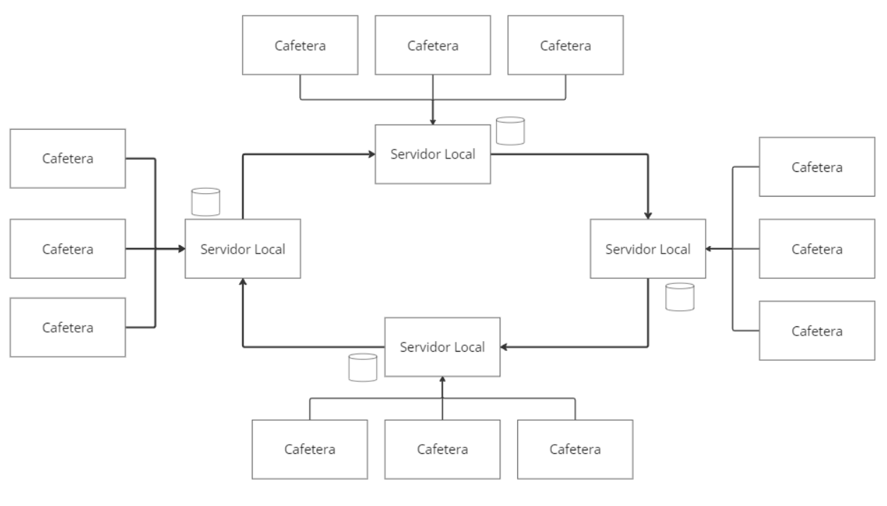
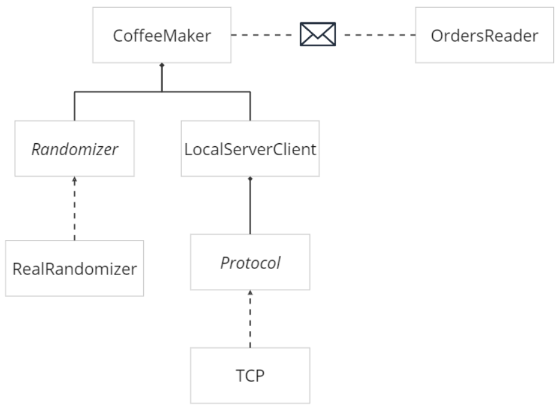
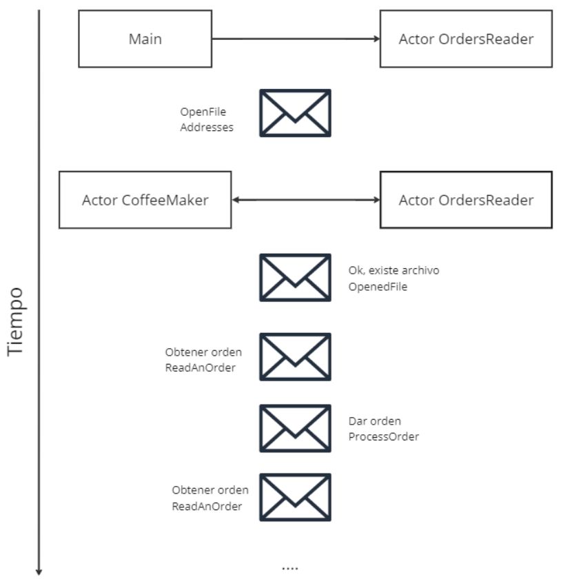
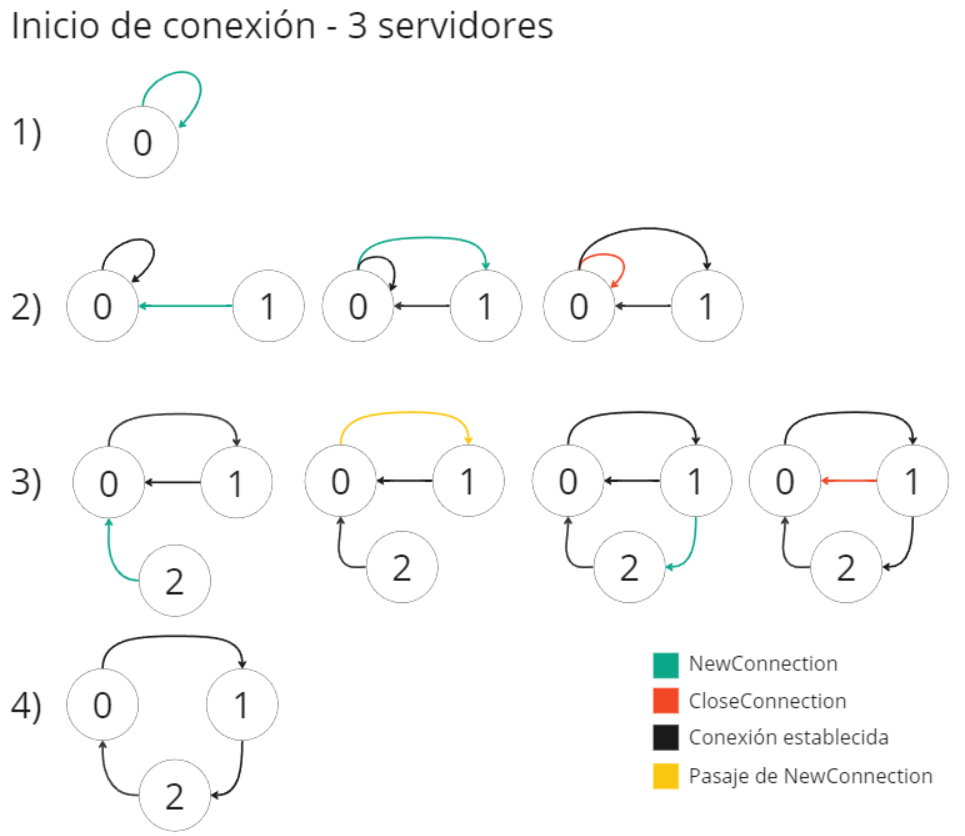
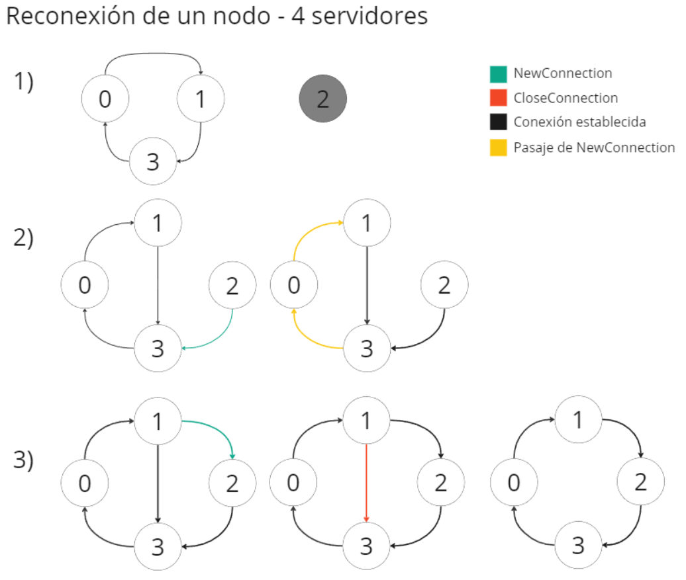
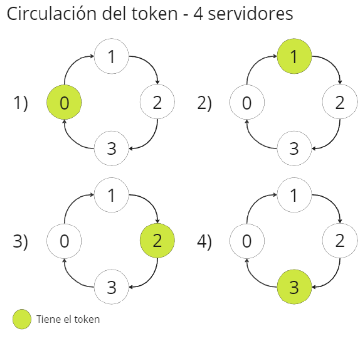
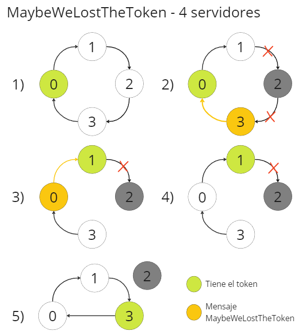
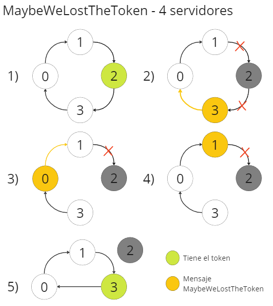
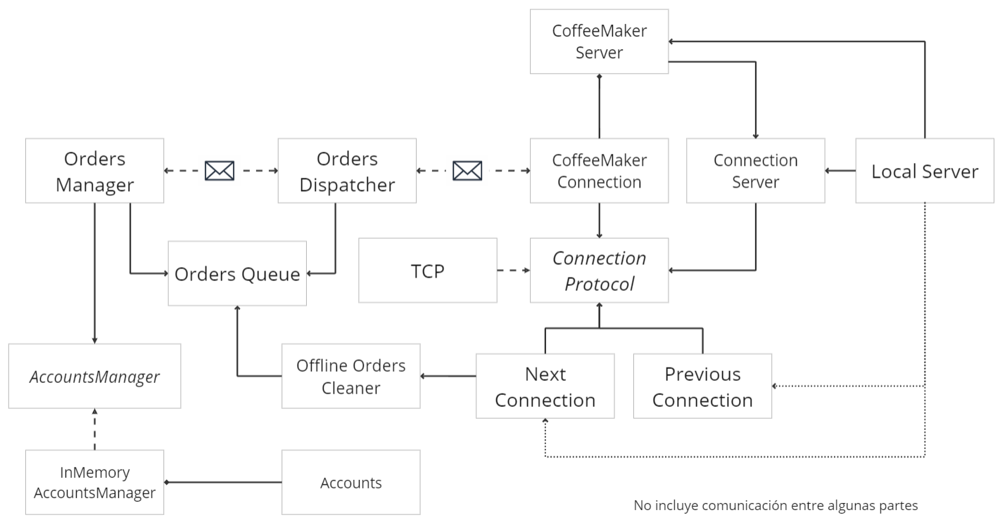
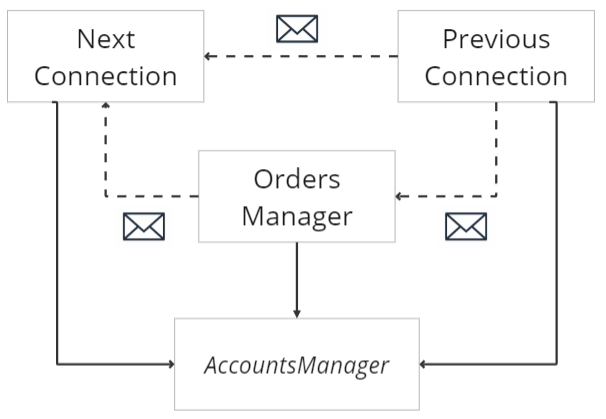

# TP2 - CoffeeGPT

El presente trabajo práctico tiene como objetivo implementar aplicaciones en Rust que modelen un sistema de puntos para fidelización de los clientes. Los clientes podrán sumar puntos por cada compra para canjearlos por cafés gratuitos.

Estas aplicaciones deben de trabajar en ambientes distribuidos susceptibles a fallas debido a perdida de conexión.

## Integrantes

| Nombre                                                        | Padrón |
| ------------------------------------------------------------- | ------ |
| [Grassano, Bruno](https://github.com/brunograssano)           | 103855 |
| [Roussilian, Juan Cruz](https://github.com/juan-roussilian)   | 104269 |
| [Stancanelli, Guillermo](https://github.com/guillermo-st)     | 104244 |

## Ejecución

La aplicación puede ser ejecutada a través de `cargo` con:

```
$ cargo run --bin [NOMBRE-APP] [ARGUMENTOS]
```

* Donde `[NOMBRE-APP]` puede ser `server` o `coffee_maker`
* Los valores de `[ARGUMENTOS]` dependen de la aplicación que se quiere ejecutar.
    * En el caso del server son `[ID] [TOTAL-SERVIDORES]` donde `[ID]` es el id del servidor (se debe de empezar con 0) y `[TOTAL-SERVIDORES]` la cantidad total de servidores que puede tener la red. Siempre se debe de iniciar el servidor 0 para que comience a funcionar correctamente.
    * En el caso de la cafetera `[IP:PORT] [FILE]` donde `[IP:PORT]` tiene la ip y puerto del servidor al que se va a conectar la cafetera y `[FILE]` el nombre del archivo. El nombre del archivo es opcional, si no se incluye se lee el ubicado en `tests/orders.csv` (definido por la constante `DEFAULT_ORDERS_FILE`)
* Se puede cambiar el nivel de log con la variable de entorno `RUST_LOG`. Algunos valores posibles son `error`, `info`, y `debug`

De forma completa quedaría:
```
$ RUST_LOG=info cargo run --bin server 0 5
$ RUST_LOG=info cargo run --bin coffee_maker 127.0.0.1:20000 tests/orders.csv
```

### Tests

Se proveen distintos casos de prueba de la aplicación. Se pueden ejecutar con:
```
$ cargo test
```

Algunas pruebas destacadas son:

### Dependencias y binarios
El trabajo práctico está dividido en las siguientes partes:
* Un binario para las cafeteras, `coffee_maker`
* Un binario para los servidores, `server`
* Una biblioteca con funcionalidades comunes a ambos binarios, `lib`


La aplicación tiene las siguientes dependencias:

* `rand` para generar números pseudoaleatorios, es usado para determinar el éxito de los pedidos.
* `actix` y `actix-rt` para el manejo de actores.
* `log` y `simple_logger` para tener la interfaz de los logs *(error!(), info!(), debug!())* y una implementación que imprime los mensajes.
* `async-std` para el manejo de tareas asincrónicas
* `async-trait` para poder definir interfaces con métodos *async*
* `bincode` y `serde` para serializar y deserializar a bytes los mensajes enviados.


## Diseño e implementación

### Arquitectura

La arquitectura del trabajo es de la siguiente forma:


* Se tienen múltiples servidores locales que replican la base de datos de los puntos y están conectados entre sí
* Cada servidor local puede manejar múltiples conexiones de cafeteras

### Cafetera

Empezamos por la cafetera, la aplicación de la cafetera simula ser la máquina que hace el café en cada pedido. Estos pedidos son leídos de un archivo.

#### Formato del archivo

La cafetera para procesar los pedidos debe de leerlos de un archivo CSV que sigue el siguiente formato `OPERACION,COSTO/BENEFICIO,NRO CUENTA`. Donde:
* `OPERACION` es el tipo de pedido, puede ser de `CASH` para sumar puntos o `POINTS` para restar puntos. 
* `COSTO/BENEFICIO` es la cantidad que se va a sumar o restar de puntos. Es un número positivo
* `NRO CUENTA` es el id numérico positivo de la cuenta que realiza la operación.

Por ejemplo:


```
CASH,200,4
POINTS,200,2
POINTS,200,11
CASH,200,12
...
```

En caso de no respetarse el formato en una línea, se salteara e intentara leer la siguiente, siempre y cuando el archivo tenga un formato válido de UTF-8. Por ejemplo

```
CASH,200,4,442 <--- Falla la lectura y reintenta
POINTasdS,200,2 <--- Falla la lectura y reintenta
POINTS,200,-11 <--- Falla la lectura y reintenta
CASH,200,12 <--- Lee y parsea correctamente
...
```

#### Modelo

El modelo de la cafetera es el siguiente:


En el diagrama podemos ver que la cafetera se puede dividir en dos partes que se comunican mediante mensajes, el lector de ordenes `OrdersReader` y la lógica del negocio en `CoffeeMaker`. Estas dos entidades están modeladas como actores.
* `OrdersReader` realiza la lectura y parseo del archivo CSV línea por línea a pedido de las cafeteras. Una vez realizada la lectura le responde a la cafetera con el pedido que tiene que realizar. Si ocurre un error en la lectura se envía un mensaje a sí mismo para que reintente y lea otra línea para esa misma cafetera.
* `CoffeeMaker` es el otro actor del modelo. Este actor realiza los pedidos de suma y resta. Cada uno tarda el tiempo definido en la constante `PROCESS_ORDER_TIME_IN_MS`.
    * Para saber si los pedidos fueron exitosos o no se separó la funcionalidad con el trait `Randomizer`. La probabilidad de éxito se define en la constante `SUCCESS_CHANCE`. Este trait adicionalmente permite manejar la parte pseudoaleatoria en los tests al usar mocks.
    * Para la comunicación con el servidor local se creó el cliente `LocalServerClient`. Este cliente se encarga de realizar y mantener la conexión.
    * `Protocol` es una interfaz para no acoplar la conexión a un protocolo de transporte en particular. La cafetera se conecta mediante TCP con el servidor local.
    * Si bien en el diagrama aparece como que hay una sola cafetera, puede configurarse mediante la constante `DISPENSERS` para que haya múltiples actores de este tipo. *Esto es para reducir la cantidad de aplicaciones a levantar.*

#### Actores y mensajes

En el siguiente diagrama se puede ver la comunicación entre los actores mencionados previamente.



1. El ciclo empieza una vez que `main` envía el mensaje `OpenFile` con las direcciones de las cafeteras a `OrdersReader`. El lector se va a guardar las direcciones y abrir el archivo.
2. Si se logra abrir exitosamente se les notifica a los actores de `CoffeeMaker` que se abrió con `OpenedFile`
3. Las cafeteras responden con el mensaje de `ReadAnOrder` para que el lector lea.
4. El lector le responde a cada cafetera que pedido tiene que atender en `ProcessOrder`
5. La cafetera procesa el pedido y vuelve a pedir otra orden.
6. Se repiten los pasos 4 y 5 hasta que se termine el archivo.

#### Comunicación con Servidor Local

Como ya se mencionó antes, para la comunicación cafetera-servidor local optamos por usar el protocolo de transporte TCP. Optamos por este protocolo debido a que garantiza que los datos serán entregados al servidor sin errores, en orden, y que la conexión con el servidor está activa.
La alternativa, UDP no garantiza nada de lo anterior, por lo que implicaba un desarrollo adicional para asegurar las propiedades mencionadas, principalmente los ACK y orden. 

Sin embargo, en la implementación se deja la libertad de intercambiar el protocolo empleado, ya que se tiene la interfaz `ConnectionProtocol`.

Pasando a los mensajes usados, se buscó tener un formato bien definido que sea independiente del tipo de pedido. Para eso definimos los campos comunes y se llegó a lo siguiente:

```rust
pub struct CoffeeMakerRequest {
    pub message_type: MessageType,
    pub account_id: usize,
    pub points: usize,
}

pub struct CoffeeMakerResponse {
    pub message_type: MessageType,
    pub status: ResponseStatus,
}
```

* `MessageType` y `ResponseStatus` son *enums* que tienen las distintas acciones/resultados.
* Los *structs* son serializados y deserializados mediante el crate `bincode` y `serde`.
* A los bytes enviados se le agrega al final el byte `;` para leer hasta ese punto.


### Servidor local

Cada sucursal de la cadena de café *CoffeeGPT* cuenta con su propio servidor local. 
Estos servidores locales tienen las conexiones con las cafeteras, las cuentas de los clientes, y controlan el acceso a los datos entre sí.

#### Comunicación

Para la comunicación entre los servidores elegimos usar el algoritmo *Token Ring* debido a que se resuelve la comunicación de forma sencilla. 
Cada servidor envía mensajes al siguiente y recibe del anterior en el anillo. Se puede ver en el diagrama de la arquitectura.

Al usar este modelo tenemos N conexiones (donde N es la cantidad de servidores), 
por lo que se vuelve una opción viable estar manteniendo esas conexiones en TCP, y de esta forma resolver el problema de asegurar que lleguen los mensajes. *Nota: Nuevamente, veremos que está la interfaz de ConnectionProtocol, por lo que se puede intercambiar.*

Pasamos ahora a ver los diferentes mensajes que pueden estar circulando por la red.

```rust
pub struct ServerMessage {
    pub message_type: ServerMessageType, // El tipo de mensaje
    pub sender_id: usize,                // Quien envio el mensaje
    pub passed_by: HashSet<usize>,       // Por quien paso el mensaje, si ya estoy en esta lista se descarta
}
```

##### Mensaje New Connection
El mensaje de `NewConnection` es el usado para indicar que hay una nueva conexión en la red. 
Se lanza al inicio cuando se levanta la red y cuando se quiere reconectar un servidor que estaba caído.

Este mensaje incluye los siguientes datos:

```rust
pub struct Diff {
    pub last_update: u128,              // Timestamp de la más reciente actualización que se tiene en la base
    pub changes: Vec<UpdatedAccount>,   // Cuentas actualizadas en base a la actualización
}
```

Veamos el funcionamiento con unos ejemplos.


En este diagrama podemos ver el comportamiento cuando se está levantando una red con 3 servidores.


1. En este paso se levantó al servidor 0. Intento conectarse con 1 y 2 pero no lo logro, por lo que se conecta consigo mismo para que empiece a circular el token. Esto solo puede pasar al comienzo y con 0.
2. Se levanta el servidor 1. 
    1. Este intenta conectarse con 2 y no pudo, se conecta con 0. 
    2. Le envía el mensaje de NewConnection con fecha de última actualización 0 (no tiene nada guardado). 
    3. 0 al recibir el mensaje establece conexión con 1 y luego cierra con `CloseConnection` su propia conexión con 0. El cierre lo hace luego de establecida la conexión con 1 en caso de que se haya caído.
    4. El token está circulando entre estos dos nodos ahora.
3. El proceso se repite, con la diferencia que 0 pasa el mensaje a 1 debido a que 2 no está entre el 0 y 1.
4. La red luego de levantados los servidores.

Este otro ejemplo muestra el comportamiento cuando se tiene una red con 4 servidores y uno estaba caído.


1. Estado inicial, la red formada del lado izquierdo y el nodo 2 sin conexión. El nodo 2 se encuentra en un *exponential backoff* intentando conectarse a la red. (Reintenta cada cierto tiempo conectarse, si falla duplica el tiempo para reintentar. Tiene un límite de `MAX_WAIT_IN_MS_FOR_CONNECTION_ATTEMPT`)
2. Le vuelve la conexión a 2 y se logra conectar con 3. En este mensaje manda la fecha más reciente del último cambio que tenga. Supongamos `1686509823`
    1. 3 reenvía el mensaje a 0 dado que 2 no está entre él y 0. Se agrega a la lista de por quienes paso el mensaje.
    2. 0 lo reenvía a 1 por los mismos motivos y se agrega a la lista de por quienes paso.
3. 1 recibe el mensaje y ve que 2 está entre 1 y 3. Debe de cambiar su siguiente
    1. Agrega los cuentas cuya actualización más reciente sea mayor a `1686509823`.
    2. Se conecta con 2 pasándole los datos agregados. 2 pisa las cuentas modificadas con estos cambios
    3. 1 cierra su conexión con 3 con un `CloseConnection`
4. La red quedó nuevamente formada


##### Mensaje Token

El mensaje del token es enviado a la red por primera vez por el 0. Este mensaje incluye los siguientes datos.

```rust
type TokenData =  HashMap<usize, Vec<AccountAction>>

struct AccountAction {
    pub message_type: MessageType,
    pub account_id: usize,
    pub points: usize,
    pub last_updated_on: u128,
}
```
El mapa tiene de clave el id del servidor que hizo los cambios y de valor los cambios realizados (las sumas o restas).



En la imagen se puede ver como se va pasando el token entre los nodos según el orden.

Los pasos que se ejecutan son los siguientes:
1. Recibo el mensaje de tipo Token desde mi conexión previa `PrevConnection`.
    * Si `PrevConnection` es una nueva conexión establezco el id de quien me envió el token como mi conexión previa.
    * Marco el estado del server como que tiene el token.
    * Limpio el token de mis datos previos y me actualizo con las modificaciones de los otros servidores. *Si algún servidor se perdió en el medio y no limpio sus datos, se evita que se repitan las operaciones con el campo de la fecha de actualización.*
2. Le paso el token a `OrdersManager` por un channel.
    * Este va a ejecutar todas las operaciones que se hayan cargado en `OrdersQueue` hasta que se recibió el token. 
    * Las operaciones de suma (son reducidas si son sobre la misma cuenta)
    * Responde si se pueden hacer las de resta
    * Espera al resultado de los pedidos de resta (**espera por cierto tiempo**, si las cafeteras tardan en responder sale por timeout) y ejecutar la resta
    * Los cambios quedan en la base local y en el token. Se ejecuta 
3. Se envía el token a `NextConnection` por un channel.
    * Si tiene guardadas **sumas de una perdida de conexión con el token** previa las agrega al nuevo token. (Solo guarda las sumas, las restas no se consideran válidas si se perdió la conexión con el token)
    * Envía el mensaje a la siguiente conexión. Si el envío falla, intenta con los siguientes. 
    * Si no logra enviarlo a alguien (crear una nueva conexión) se considera que se perdió la conexión con el token y nos guardamos las sumas.
    * Marcamos que no tenemos el token y se guarda una copia del token si efectivamente se envió.

##### Mensaje Maybe We Lost The Token
Este mensaje se envía a través de la red cada vez que se detecta una perdida de conexión con el anterior. Nos damos cuenta de esta situación porque se perdió la conexión TCP, los casos que pueden estar ocurriendo son que el mismo nodo perdió su conexión o el anterior la perdió.

* El mensaje enviado incluye el id de que servidor se cayó.
* El mensaje tiene el nombre de `MaybeWeLostTheToken` debido a que lo que se busca es encontrar donde quedo el token al momento de la caida del servidor. Si algún servidor tiene el token no se perdió. Si nadie lo tiene se perdió en el servidor que se cayó.

Empezamos con el algoritmo:
1. Detecto la perdida de conexión con el anterior.
    * Si yo tenía el token, no es necesario enviar el mensaje al siguiente. En todo caso, si yo perdí la conexión, fallara el envío del token y se manejara.
    * Si yo no tenía el token, le paso el mensaje a `NextConnection` para que lo intente reenviar.
2. En `NextConnection` revisamos si el que se cayó es al nodo al que se apunta. (Seguimos en el mismo nodo que el paso anterior)
    * Si es así, nos conectamos con el siguiente y le pasamos una copia del último token que tenemos guardado. Si fallo el envío, perdimos la conexión.
    * Si no es así, pasamos el mensaje al siguiente. Si falla este envío intentamos enviar el mensaje a alguien que esté entre nosotros y el nodo caído. En este caso, si falla con todos nosotros nos caímos.
    * (Desde otro nodo) Si tenemos una conexión previa y fallan todos los que están en el medio, envío yo la copia del token al siguiente que pueda.
3. Sí recibimos el mensaje en algún nodo siguiente
    * Si `PrevConnection` es una nueva conexión, establezco el id de quien me envió el mensaje como mi conexión previa.
    * Compruebo si yo tengo el token. Si lo tengo descarto el mensaje dado que no se perdió y la red se va a rearmar cuando lo pase al siguiente.
    * Paso el mensaje a `NextConnection` (paso 2 pero desde este nodo)


Veamos algunos ejemplos:




En la imagen se puede ver el caso en que se pierde la conexión de un nodo (el 2) pero el token sigue adentro de la red. El mensaje de MaybeWeLostTheToken circula hasta que alcanza al token en el nodo 1. En ese punto el nodo 1 lo descarta dado que no se perdió.




En el diagrama se puede ver:
1. El nodo 2 tiene el token
2. El nodo 2 pierde la conexión y el nodo 3 se da cuenta de que perdió la conexión con 2. Reenvía el mensaje a 0.
3. 0 recibe el mensaje y lo reenvía a 1.
4. 1 recibe el mensaje y se da cuenta de que el que se cayó es al que apunta. Le envía la copia del token a 3.
5. 3 Recibe la copia del token y sigue circulando por la red.

#### Modelo



Relaciones faltantes del diagrama anterior



En los diagramas podemos ver el modelo y relaciones que tiene el servidor. Explicamos su función:
* `ConnectionServer` representa a un servidor genérico. La implementación actual es de un servidor TCP. Se puede llegar a intercambiar con UDP.
* `CoffeeMakerServer` es el servidor de las cafeteras. Maneja las conexiones entrantes de las cafeteras. Recibe las conexiones y les crea un hilo para manejar esa conexión en particular en `CoffeeMakerConnection`.
* `LocalServer` es la entidad central del servidor. Inicializa las partes de la aplicación y se pone a escuchar por conexiones entrantes a través de su `ConnectionServer`.
* `ConnectionProtocol` es la interfaz mencionada previamente en la cafetera. Se reutiliza la implementación de TCP en el servidor.
* `PreviousConnecton` maneja los mensajes recibidos de la conexión anterior. En el segundo diagrama podemos ver que puede llegar a pasar los mensajes al `NextConnection`, o al `OrdersManager` en caso del token. Esta conexión es inicializada por `LocalServer`.
* `NextConnection` es el encargado de enviar los mensajes a la siguiente conexión en el anillo. Al enviar los mensajes es el que termina determinando si el servidor tiene conexión o no.
* `OrdersDispatcher` es un manejador intermedio que recibe los mensajes de las cafeteras (enviados por un canal desde `CoffeeMakerConnection`). Esta estructura tiene la lógica para determinar la respuesta a un pedido. Se decidió separar esta lógica para no acoplarse a la función que cumple la conexión con la cafetera.
    * Si es suma, resta o cancelar el bloqueo de los puntos, la respuesta es siempre OK
    * Si es pedido de bloqueo de puntos, pone la respuesta en espera. (Si no se tiene conexion se le responde que no)
* `OrdersManager` realiza los pedidos recibidos y responde a los pedidos de puntos. Esta entidad se ejecuta cada vez que se recibe el token por el channel. Al recibir el token, agarra los pedidos cargados en `OrdersQueue` y los realiza. Agrega los cambios al token.
* `OrdersQueue` almacena los pedidos se suma y pedidos de querer restar. Son agregados por el `OrdersDispatcher` y sacados por el `OrdersManager`. La cola tiene una optimación en los pedidos de suma al reducirlos si se estan haciendo sobre una misma cuenta.
* `OfflineOrdersCleaner` en caso de perder la conexión se deben de limpiar y responder a las cafeteras los pedidos de resta. Esta función es ejecutada por el `NextConnection` pasado un tiempo de detectada la perdida de conexión.
* `AccountsManager` es una interfaz hacia la base de datos de los puntos. En la implementación se tiene solamente `InMemoryAccountsManager` que representa y realiza las acciones con un mapa en memoria.
* `Account` representa a una cuenta familiar.


## Dificultades encontradas
A lo largo del desarrollo del Trabajo Práctico, nos encontramos con las siguientes dificultades:

* Fue difícil elegir entre los distintos algoritmos vistos cuál aplicar a la arquitectura distribuida de los servidores de cafetería. Originalmente habíamos pensado en un algoritmo centralizado con elección mediante Bully, pero al analizar en mayor profundidad diferentes casos borde con este algoritmo terminamos optando por Token Ring por tener aparentemente menor dificultad de implementación, y por cantidad de conexiones simultáneas a abrir.
* También tuvimos que debatir en varias instancias si utilizar conexiones TCP o UDP. Decidimos ir por TCP para no tener que implementar una capa de confiabilidad arriba de UDP. Creemos que esta elección también se ve justificada por la arquitectura de Token Ring, donde tenemos pocas conexiones simultáneas y, por lo tanto, no ahorraríamos tanto con UDP, como si podría ser en el caso de necesitar $N^2$ conexiones totales. De todas formas creamos una abstracción arriba de nuestras conexiones que nos podría permitir probar otros protocolos más adelante.
* Las situaciones distribuidas implicaron considerar, probar y reflexionar acerca de docenas de casos bordes posibles, así como la forma de manejarlos. Recrear estos casos bordes levantando varias instancias de las aplicaciones y analizando logs puede resultar un proceso largo.
* Tuvimos que enfrentar cierta curva de aprendizaje inherente a las librerías async y al propio lenguaje Rust.

## Mejoras
Mencionamos algunas mejoras posibles o pendientes que se pueden hacer sobre la implementación actual:
* Mejorar la performance en los pedidos de resta. Actualmente, si hay pedidos de resta en alguna cafetera se espera un tiempo (puede salir por timeout) para obtener el resultado del café y así guardar el cambio. Esto se podría mejorar respondiendo a la cafetera si puede hacer o no el café, si puede hacerlo bloquear esos puntos y comunicar ese bloqueo a través del token (se pasa al siguiente). La cafetera responderá en algún momento el resultado, el servidor lo guardará, y cuando tenga el token nuevamente se restaran o liberaran los puntos afectados. Este resultado sería luego comunicado. Con este cambio se mejora el fairness del sistema.
* Poder manejar múltiples restas sobre una misma cuenta en el mismo servidor. Actualmente, se termina ejecutando la primera que reserve la cuenta. Se podría ir llevando un registro de puntos potencialmente consumidos para permitir múltiples consumos sobre esa cuenta en el mismo servidor.

## Documentación
La documentación de la aplicación se puede ver con:
```
$ cargo doc --open
```
